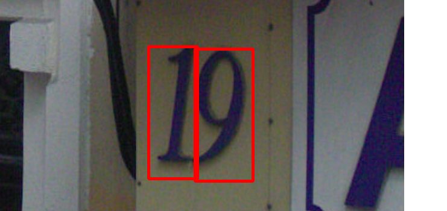

# 天池街景字符识别赛事Task02 数据读取与数据扩增
## 1 数据读取
### 1.1 图像读取
使用Pillow读取图像
```
from PIL import Image
import os

folder = "data\mchar_train"
file = os.path.join(folder, "000000.png")
im = Image.open(file)
im.show()
```

使用cv2读取图像
```
import cv2
import os

folder = "data\mchar_train"
file = os.path.join(folder, "000000.png")
img = cv2.imread(file)
# img = cv2.cvtColor(img, cv2.COLOR_BGR2RGB)
cv2.imshow("image", img)
cv2.waitKey(0)
```
### 1.2 标签读取
使用json读取train.json标签，并获取字符的位置和标签，将其绘制在图上
```
import os
import cv2
import json

folder = "data/mchar_train"
img_file = os.path.join(folder, "000000.png")
json_file = "data/mchar_train.json"
labels = json.load(open(json_file))
img = cv2.imread(img_file)
print(labels['000000.png'])
print(list(labels['000000.png']))
for i in range(len(labels['000000.png']['height'])):
    cv2.rectangle(img,(int(labels['000000.png']['left'][i]),int(labels['000000.png']['top'][i])),(int(labels['000000.png']['left'][i])+int(labels['000000.png']['width'][i]),int(labels['000000.png']['top'][i])+int(labels['000000.png']['height'][i])), (0, 0, 255),3)
cv2.imshow("image", img)
cv2.waitKey(0)
cv2.imwrite("000000.png",img)
```

## 2 pytorch读取数据与数据扩增
### 2.1 pytorch读取数据
```
import torch,glob,json,os
import torch.utils.data.dataset as Dataset
import torch.utils.data.dataloader as DataLoader
import numpy as np
from PIL import Image
import cv2
import torchvision.transforms as transforms

class subDataset(Dataset.Dataset):
    # 初始化图片、标签路径和变换
    def __init__(self, img_path, img_label, transform=None):
        self.img_path = img_path
        self.img_label = img_label
        if transform is not None:
            self.transform = transform
        else:
            self.transform = None
    # 图片数
    def __len__(self):
        return len(self.img_path)
    # 获取数据集内容
    def __getitem__(self,index):
        # 读取图片并变换
        img = Image.open(self.img_path[index]).convert('RGB')
        if self.transform is not None:
            img = self.transform(img)
        # 读取标签
        f = open(self.img_label)
        annotations = json.load(f)[os.path.split(self.img_path[index])[1]]
        return img, annotations
# 文件路径
train_path = glob.glob('data/mchar_train/*.png')
train_path.sort()
train_label = 'data/mchar_train.json'

if __name__ == '__main__':
    dataset = subDataset(train_path, train_label,transforms.Compose([transforms.ToTensor()]))
    dataloader = DataLoader.DataLoader(dataset, batch_size=1, shuffle=False, num_workers=4)
    for i, item in enumerate(dataloader):
        print('i:',i)
        data, label = item
        print('data:', data)
        print('label:', label)
```

### 2.2 数据扩增
在创建dataset时，设置transforms，包括缩放到固定尺寸(transforms.Resize)、随机颜色变换(transforms.ColorJitter)、随机旋转(transforms.RandomRotation)等
```
import torch,glob,json,os
import torch.utils.data.dataset as Dataset
import torch.utils.data.dataloader as DataLoader
import numpy as np
from PIL import Image
import cv2
import torchvision.transforms as transforms

class subDataset(Dataset.Dataset):
    def __init__(self, img_path, img_label, transform=None):
        self.img_path = img_path
        self.img_label = img_label
        if transform is not None:
            self.transform = transform
        else:
            self.transform = None

    def __len__(self):
        return len(self.img_path)

    def __getitem__(self,index):
        img = Image.open(self.img_path[index]).convert('RGB')
        if self.transform is not None:
            img = self.transform(img)
        f = open(self.img_label)
        annotations = json.load(f)[os.path.split(self.img_path[index])[1]]
        return img, annotations

train_path = glob.glob('data/mchar_train/*.png')
train_path.sort()
train_label = 'data/mchar_train.json'

if __name__ == '__main__':
    dataset = subDataset(train_path, train_label,transforms.Compose([
              # 缩放到固定尺寸
              transforms.Resize((64, 128)),

              # 随机颜色变换
              transforms.ColorJitter(0.2, 0.2, 0.2),

              # 加入随机旋转
              transforms.RandomRotation(5),

              # 将图片转换为pytorch 的tesntor
              transforms.ToTensor(),

              # 对图像像素进行归一化
              transforms.Normalize([0.485,0.456,0.406],[0.229,0.224,0.225])
    ]))
    dataloader = DataLoader.DataLoader(dataset, batch_size=1, shuffle=False, num_workers=4)
    for i, item in enumerate(dataloader):
        print('i:',i)
        data, label = item
        print('data:', data)
        print('label:', label)
```

|1|2|3|      
|----|-----|------|          
| | | |
| | | |
