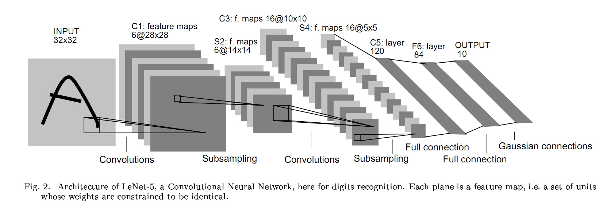

# 天池街景字符识别赛事Task03 字符识别模型
- 由于明日进行毕业答辩 没有足够的时间完成所有Task的学习 答辩完成后将进行补充、修改

## 3.1 卷积相关参数

- 卷积核的大小ksize
- 卷积核一次在原图上移动的步长，称为stride
- 在实际运用中，有一种给原图打补丁的策略，用来调整输出的图像大小，即在原图周围填充0，填充的多少为padding

## 3.2 卷积层
如果给卷积核赋一些随机的数，把其作为神经网络的一部分参数，对原图像进行一次卷积运算，再连接上一些隐藏层，最后得到一个输出层，得到一个损失函数，通过优化方法求解所有参数最优解，即实现了卷积层。<br>
一个卷积核可以得到一个输出，多个卷积核可以得到多个，一个卷积层一般由若干卷积核排列而成。

## 3.3 池化层
池化层是一个下采样的操作，快速减小输入的大小，同时不至于丢失重要的信息<br>
一般有两种池化层：<br>
- max pooling
- average pooling

## 3.4 卷积神经网络
卷积神经网络（简称CNN）是一类特殊的人工神经网络，是深度学习中重要的一个分支。CNN在很多领域都表现优异，精度和速度比传统计算学习算法高很多。特别是在计算机视觉领域，CNN是解决图像分类、图像检索、物体检测和语义分割的主流模型。<br>
CNN是一种层次模型，输入的是原始的像素数据。CNN通过卷积（convolution）、池化（pooling）、非线性激活函数（non-linear activation function）和全连接层（fully connected layer）构成。

## 3.5 LeNet
用于MNIST数据集最经典的CNN，由Yann LeCun提出，具有两个卷积+池化层及三个全连接层。


## 3.6 构建CNN
构建模型代码如下：
```
import torch
torch.manual_seed(0)
torch.backends.cudnn.deterministic = False
torch.backends.cudnn.benchmark = True

import torchvision.models as models
import torchvision.transforms as transforms
import torchvision.datasets as datasets
import torch.nn as nn
import torch.nn.functional as F
import torch.optim as optim
from torch.autograd import Variable
from torch.utils.data.dataset import Dataset

# 定义模型
class SVHN_Model1(nn.Module):
    def __init__(self):
        super(SVHN_Model1, self).__init__()
        # CNN提取特征模块
        self.cnn = nn.Sequential(
            nn.Conv2d(3, 16, kernel_size=(3, 3), stride=(2, 2)),
            nn.ReLU(),  
            nn.MaxPool2d(2),
            nn.Conv2d(16, 32, kernel_size=(3, 3), stride=(2, 2)),
            nn.ReLU(), 
            nn.MaxPool2d(2),
        )
        # 
        self.fc1 = nn.Linear(32*3*7, 11)
        self.fc2 = nn.Linear(32*3*7, 11)
        self.fc3 = nn.Linear(32*3*7, 11)
        self.fc4 = nn.Linear(32*3*7, 11)
        self.fc5 = nn.Linear(32*3*7, 11)
        self.fc6 = nn.Linear(32*3*7, 11)
    
    def forward(self, img):        
        feat = self.cnn(img)
        feat = feat.view(feat.shape[0], -1)
        c1 = self.fc1(feat)
        c2 = self.fc2(feat)
        c3 = self.fc3(feat)
        c4 = self.fc4(feat)
        c5 = self.fc5(feat)
        c6 = self.fc6(feat)
        return c1, c2, c3, c4, c5, c6
    
model = SVHN_Model1()
```
构建后输出模型如下：
```
SVHN_Model1(
  (cnn): Sequential(
    (0): Conv2d(3, 16, kernel_size=(3, 3), stride=(2, 2))
    (1): ReLU()
    (2): MaxPool2d(kernel_size=2, stride=2, padding=0, dilation=1, ceil_mode=False)
    (3): Conv2d(16, 32, kernel_size=(3, 3), stride=(2, 2))
    (4): ReLU()
    (5): MaxPool2d(kernel_size=2, stride=2, padding=0, dilation=1, ceil_mode=False)
  )
  (fc1): Linear(in_features=672, out_features=11, bias=True)
  (fc2): Linear(in_features=672, out_features=11, bias=True)
  (fc3): Linear(in_features=672, out_features=11, bias=True)
  (fc4): Linear(in_features=672, out_features=11, bias=True)
  (fc5): Linear(in_features=672, out_features=11, bias=True)
  (fc6): Linear(in_features=672, out_features=11, bias=True)
```
